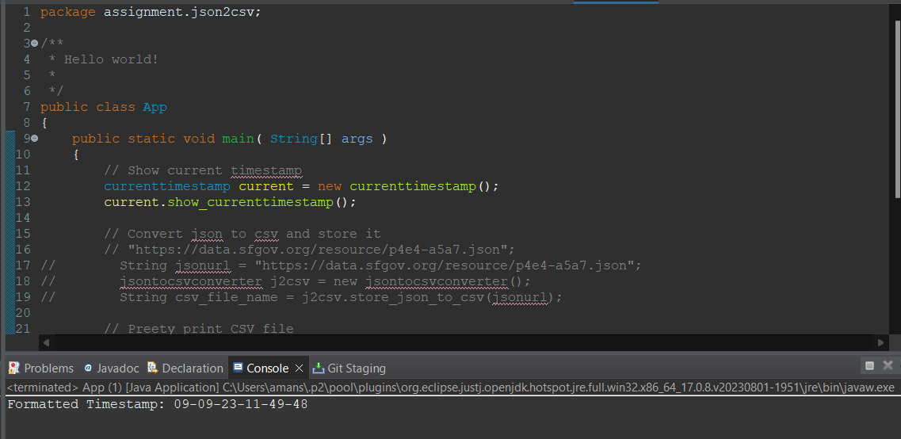
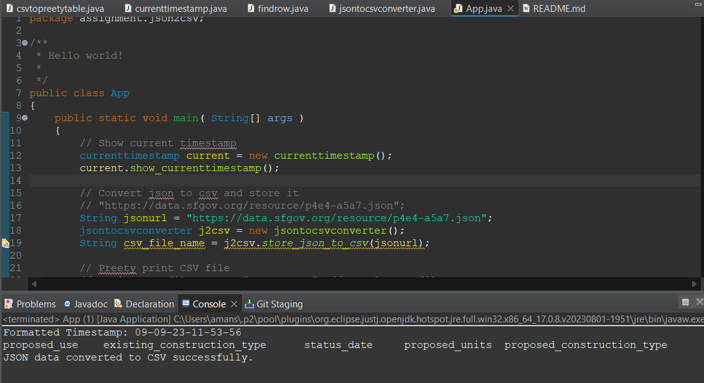
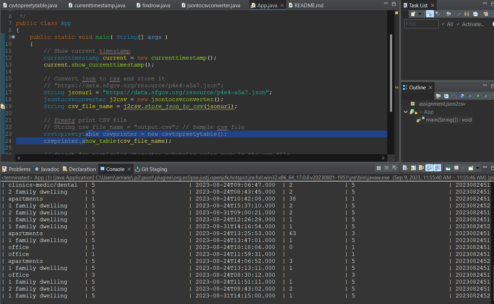
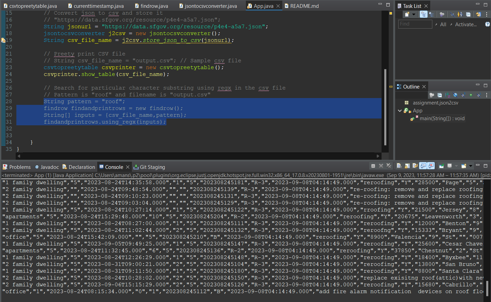

# JSON to CSV Converter

#### How to run the project ?
main method is present in the /json2csv/src/main/java/assignment/json2csv/App.java

### File structure
- csvtopreetytable.java   	: This files contains the functionality to print table from the given csv file.
- currenttimestamp.java   	: This file contains show_currenttimestamp function which show current timestamp in desired format.
- findrow.java 			  	: This file having functionality to find rows from a csv file based on given patterns.
- jsontocsvconverter.java 	: This contains the functionality to retrieve data from given json url and store  it as a csv file.
- App.java					: This file contains the main method which will call the above functionalities to show current time, retrieve data from json url and store it in csv file, and finally search for specific records having specified regex pattern.

## Outputs

A. Current timestamp

B. Storing json file with unique column names and success message

C. Printing the csv table in console

D. Finding rows containg roof using regex

